# Website informasi parkir gratis bandung 

## DAFTAR ISI 
### KATA PENGANTAR
### PRAKATA
### DAFTAR ISI
### DAFTAR GAMBAR
### CHAPTER 1 PENGENALAN (WEEK 1)
### 1.1 Bahasa pemrograman yang digunakan
### 1.1.1 HTML
### 1.1.2 CSS
### 1.1.3 JAVASCRIPT
### 1.1.4 CSS SKELETON / GETSKELETON
### 1.1.5 Golang
### 1.2 Aplikasi yang digunakan
### 1.4.1 Visual Studio Code
### 1.2.2 Mongodb
### 1.2.3 Instalasi aplikasI
### 1.2.4 Visual studio code
### CHAPTER 2 PERSIAPAN LINGKUNGAN DAN PENGEMBANGAN (WEEK 1)
### 2.1 Instalasi Visual Studio Code
### 2.2 Instalasi Mongodb
### 2.3 Ekstensi yang digunakan pada golang
### CHAPTER 3 MEMBANGUN BACKEND (WEEK 2-3)
### 3.1 Hosting menggunakan GOOGLE CLOUD PLATFORM (GCP)
### 3.2 Membangun backend menggunakan golang 
### 3.3 Testing API menggunakan postman
### CHAPTER 4 MEMBANGUN FRONTEND (WEEK 3-4)
### 4.1 Struktur pada frontend 
### 4.1.1 Halaman utama (index.html)
### 4.1.2 Desain halaman utama (style.css)
### 4.1.3 Fungsi Halaman utama ( File  javaScript/ Controller)	
### 4.1.4 Halaman Login (login.html)	
### 4.1.5 Desain Halaman Login (login.css)	
### 4.1.6 Fungsi Halaman Login (login.js)	
### 4.1.7 Halaman Admin (admin.html)	
### 4.1.8 Desain Halaman Admin (admin.css)	
### 4.1.9 Fungsi Halaman Admin (admin.js)	
### CHAPTER 5  TAMPILAN WESBSITE YANG SUDAH DIBUAT (week 4)	
### 5.1	Tampilan Map dan Marker	
### 5.2	Tampilan Popup dan Form	
### 5.3	Tampilan Login Admin	
### 5.4	Tampilan Dashboard Admin	
### DAFTAR PUSTAKA	
### GLOSARIUM	
### INDEKS	

### KATA PENGANTAR

Segala puji bagi Allah, Tuhan Yang Maha Esa atas karunia dan rahmat-Nya sehingga penulis dapat menyelesaikan buku ini. Sholawat serta salam semoga senantiasa tercurahkan kepada Nabi Besar Muhammad SAW.
Kami ucapkan juga rasa terima kasih kami kepada pihak-pihak yang mendukung lancaranya pembuatan buku ini mulai dari proses penulisan hingga proses cetak, yaitu orang tua kami, pembimbing kami, rekan-rekan kami, dan masih banyak lagi yang tidak bisa kami sebutkan satu per satu.
Adapun, buku kami yang membahas tentang Sistem Informasi Parkir Gratis ini telah selesai kami buat semaksimal dan sebaik mungkin agar menjadi manfaat bagi pembaca yang membutuhkan informasi dalam mengembangkan sistem informasi parkir gratis pada map yang efisien dan ekonomis.
Kami sadar, masih banyak kekeliruan yang tentu saja jauh dari sempurna dalam buku ini. Oleh karena itu, kami mohon agar pembaca memberi kritik serta saran terhadap buku ini agar kami dapat terus meningkatkan kualitasnya. Demikian buku ini kami buat, dengan harapan agar pembaca dapat memahami informasi mengenai sistem informasi parkir gratis dan mendapatkan wawasan yang bermanfaat bagi masyarakat luas Terima kasih.

### PRAKATA

Pada era teknologi yang terus berkembang, teknologi telah masuk ke berbagai aspek kehidupan kita, termasuk cara kita mengelola fasilitas umum seperti parkir. Salah satu inovasi yang semakin populer adalah sistem informasi parkir gratis berbasis peta open street map, yang membuat mencari dan mengelola informasi parkir gratis lebih mudah dan lebih fleksibel.
Sistem informasi parkir gratis ini menggabungkan teknologi internet dengan manajemen parkir. Dalam hal ini, pengguna dapat menggunakan web untuk menemukan parkir gratis di berbagai lokasi. Informasi ini terdapat lokasi tempat parkir pada map di marker yang sudah dibuat dan lokasi sudah di survei sebelum memasukan data pada map.
Tujuan dari buku ini adalah untuk memberikan petunjuk tentang cara membuat sistem informasi parkir gratis berbasis peta digital yang mudah diakses oleh masyarakat. Buku ini disusun dengan cara yang mudah diikuti oleh pembaca pemula, dan setiap bagian memiliki penjelasan rinci yang disertai dengan gambar dan contoh kode program.
Kami berharap pembaca yang tertarik untuk membangun sistem serupa dapat menggunakan buku ini sebagai sumber inspirasi dan panduan praktis. Anda dapat mengakses semua kode program yang disajikan dalam buku ini melalui tautan berikut: https://github.com/parkirgratis/parkirgratis.github.io

## CHAPTER 1 PENGENALAN (WEEK 1 )  

## 1.1 Bahasa pemrograman yang digunakan

### 1.1.2 HTML  

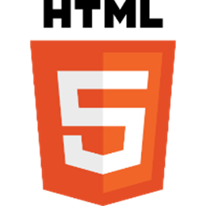

HTML adalah singkatan dari Hypertext Markup Language, yang merupakan bahasa markup standar untuk membuat halaman web dan aplikasi web.
Ini digunakan untuk menyusun konten di web dengan mendefinisikan makna dan tata letak teks, gambar, tautan, dan elemen lainnya. Elemen HTML diwakili oleh tag yang tertutup dalam tanda kurung sudut, seperti < head >,< title >,< body >, dll. HTML sangat penting untuk pengembangan web dan merupakan dasar dari sebagian besar situs web di internet.( Izzeddin Gur, 2022) 

### 1.1.3	CSS	 

CSS adalah singkatan dari Cascading Style Sheets, yang merupakan bahasa lembar gaya yang digunakan untuk menggambarkan presentasi dokumen yang ditulis dalam HTML. Ini mengontrol tata letak dan tampilan beberapa halaman web sekaligus dengan memisahkan konten dari desain. CSS memungkinkan pengembang web untuk menentukan gaya untuk berbagai elemen seperti font, warna, spasi, dan tata letak.(Daniel Zhu, Salome Wairimu Kariuki 2020) 

### 1.1.4	JAVASCRIPT	 

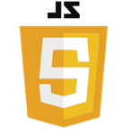

JavaScript adalah bahasa pemrograman tingkat tinggi yang ditafsirkan terutama digunakan untuk membuat konten interaktif dan dinamis di situs web. JavaScript memungkinkan pengembang untuk menambahkan fungsionalitas ke halaman web, mengontrol perilaku elemen yang berbeda, dan berinteraksi dengan pengguna secara real-time. Biasanya digunakan untuk tugas-tugas seperti validasi formulir, membuat peta interaktif, pembaruan konten dinamis, dan lain-lain. (Abhishek Gedam, 2023) 

### 1.1.5	CSS SKELETON / GETSKELETON	 

Skeleton adalah Framework CSS yang ringan dan responsif yang dirancang untuk memberikan kerangka kerja dasar untuk pengembangan web. Ini terdiri dari grid sederhana, elemen dasar seperti tombol, formulir, dan tipografi, serta beberapa komponen responsif yang memungkinkan pengembang memulai proyek web dengan cepat tanpa harus menulis CSS dari awal. 

### 1.1.6	Golang

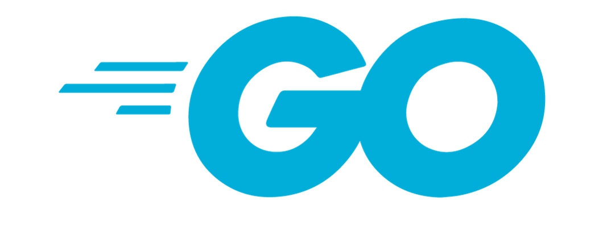

Menurut (Agung et al., 2017) Golang adalah bahasa pemrograman untuk sistem informasi berbasis cloud yang memiliki performa yang lebih cepat dari pada bahasa pemrograman PHP yang lebih banyak dipakai. Go atau sering juga disebut Golang adalah bahasa pemrograman yang free dan open source dari Google. Bahasa ini dibuat pada tahun 2007 oleh Robert Griesemer, Rob Pike, dan Ken Thompson. Meskipun demikian Golang pertama kali dirilis ke public sebagai proyek open source pada tanggal 10 November 2009. Setelah desain dan pengembangan yang berlangsung selama bertahun-tahun, Golang versi stabil (versi 1) akhirnya dirilis pada tanggal 28 Maret, 2012(A Lulu – 2023)

### 1.2 Aplikasi yang digunakan

### 1.2.1	VISUAL STUDIO CODE	 

Visual Studio Code adalah editor kode sumber yang ringan namun kuat yang berjalan di desktop Anda dan tersedia untuk Windows, macOS dan Linux. Muncul dengan dukungan built-in untuk JavaScript, TypeScript dan Node.js dan memiliki ekosistem ekstensi yang kaya untuk bahasa dan runtime lain (seperti C ++, C #, Java, Python, PHP, Go, .NET).(Code.visualstudio.com 05 juni 2024)  

### 1.2.2 MONGODB 

MongoDB adalah basis data NoSQL yang bersifat document based. MongoDB bersifat document based artinya MongoDB tidak memilki tabel,
kolom ataupun baris. MongoDB hanya memilki koleksi dan dokumen.Data yang disimpan dalam basis data MongoDB berupa file JSON yang disebut dengan istilah BSON (Binary JSON).Sistem basis data MongoDB menggunakan key-value, artinya setiap dokumen dalam MongoDB dipastikan memilki key (Putra & Rahmayeni, 2016). 

### CHAPTER 2 PERSIAPAN LINGKUNGAN DAN PENGEMBANGAN (WEEK 1) 

### 2.1 Instalasi aplikasi

### 2.1.1 Visual Studio Code

1.	Kunjungi website resmi visual studio code di https://code.visualstudio.com

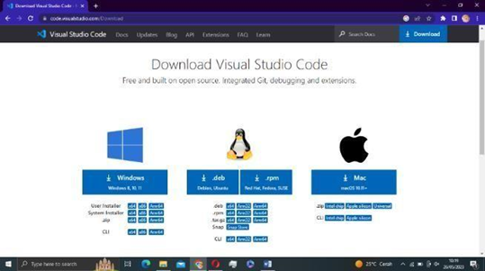

2.	Di halaman utama, anda akan melihat tombol unduh untuk windows, linux, dan macOS. Silahkan klik tombol unduh yang sesuai dengan sistemoperasi anda.
3.	Setelah unduhan selesai, temukan file yang telah diunduh di perangkatanda.
4.	Lalu buka file yang sudah di download, maka akan menampilkan sepertigambar dibawah, pilih bagian “I accept the agreement”, lalu klik Next.

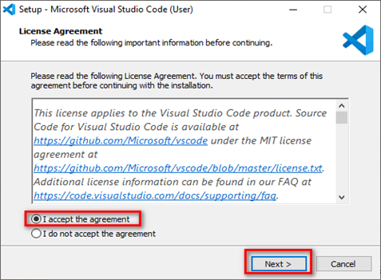

5.	Untuk Select Destination Location bisa dibiarkan saja jika lokasi instalasitidak akan dirubah. Klik Next.

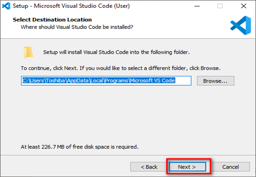

6.	Kemudian, apabila muncul tampilan Select Start Menu Folder sepertigambar di bawah, klik Next lagi jika tidak akan merubah Start Menu Folder.

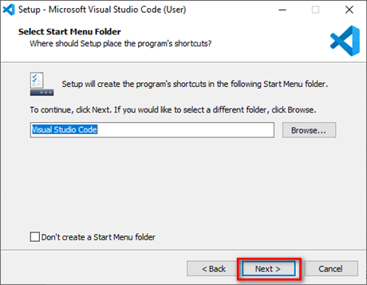

7.	Selanjutnya, jika muncul tampilan Select Additional Tasks seperti gambardibawah, centang semua. Kemudian Next.

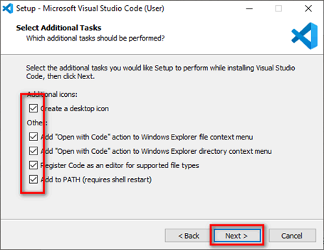

8.	Setelah itu, klik Install untuk memulai proses instalasi.

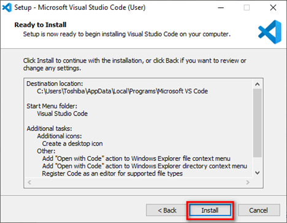

9.	Lalu tunggu sampai proses instalasi selesai.

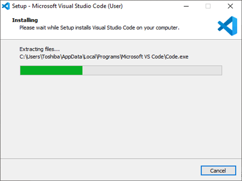

10.	Setelah selesai, klik Finish.

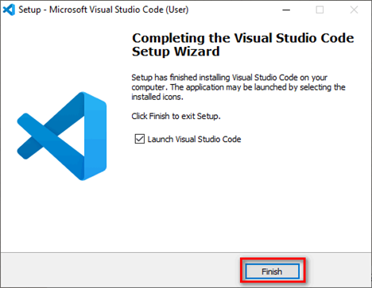

### 2.1.2 Mongodb

1. Pertama anda perlu membuat akun mongodb pada website ini https://www.mongodb.com/ lalu anda bisa klik start free pada gambar di bawah ini.

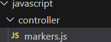

2. Setelah itu anda akan diarahkan untuk membuat akun mongodb.

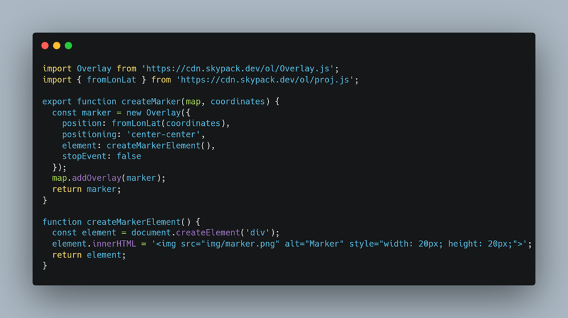

3. Setelah anda berhasil membuat akun/signup anda harus mengisi data di bawah sesuai dengan kebutuhan.

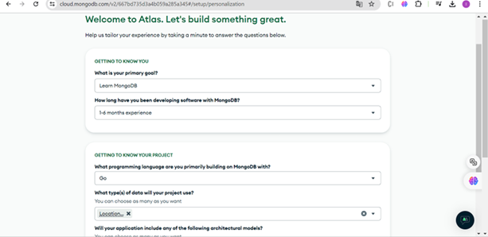

4. Pada halaman deploy ini pilih free plan lalu nama sesuaikan saja, pada provider pilih Google Cloud, pada region pilih Jakarta, dan nama cluster sesuaikan saja lalu pilih Create Deployment.

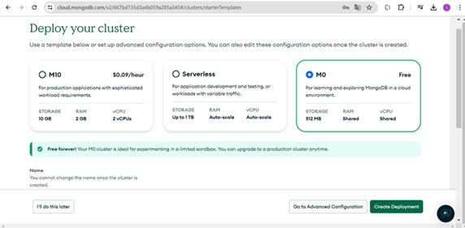

5. Setelah itu ganti password agar tidak pusing lalu pilih Create Database User.

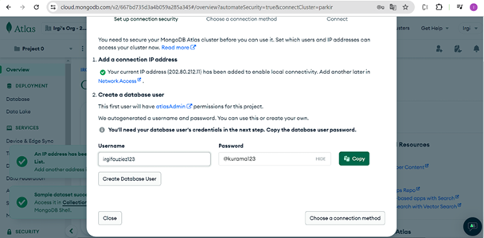

6. Lalu pada connection method pilih compass.

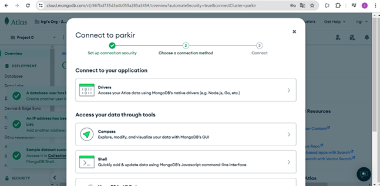

7. Jika anda belum menginstall mongocompass klik dowload compas pada gambar di bawah lalu copy connection string di paling bawah.

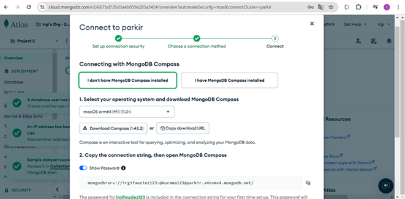

8. Pada mongodb.com untuk dapat diakses pada semua IP Address, pada security klik network acces klik ALLOW ACCESS FROM ANYWHERE atau dengan menuliskan 0.0.0.0/0

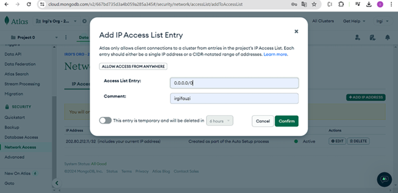

9. Setting environment masuk ke setting masuk ke environment setting klik environment variable klik new masukan variable MONGOSTRING dan value masukan connection string anda dan save.

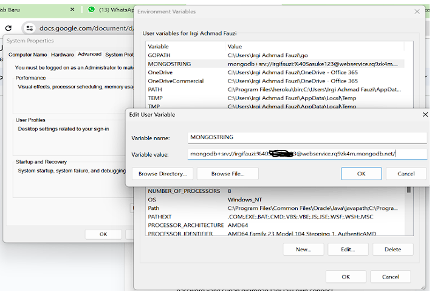

10. Buka Mongo DB Compas, Kemudian Add New Connection, tempe connection string yang sudah di salin tadi, ganti kurung sikunya dengan password yang sudah disimpan tadi lalu pilih connect. 

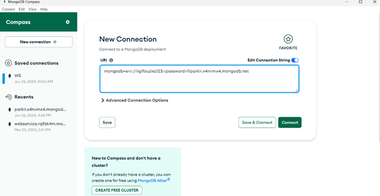

11. Struktur tabel/collection di MongoDB sudah terlihat dan terdapat data dalam bentuk json.

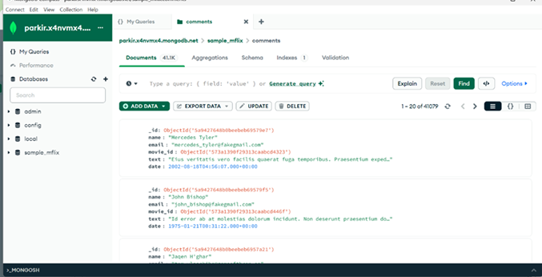

### 2.1.3 GOLANG

1. Instalasi Golang melalui link ini https://go.dev/dl/ lalu pilih Microsoft window.

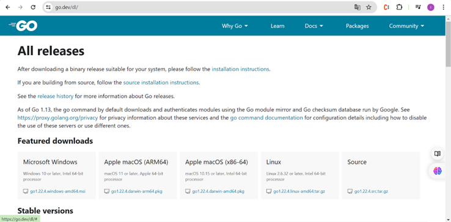

2. Setelah menginstall golang lalu masuk setting Environment, lalu pilih environment Variable.

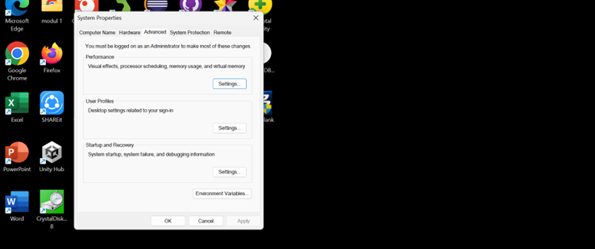

3. Pilih PATH klik edit pilih new dan masukan C:\Go\bin seperti pada gambar di bawah.

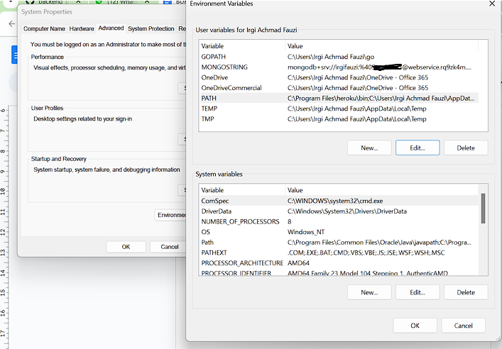

4. setelah menambahkan path lalu cek golang di Command Prompt dengan mengetik go version.

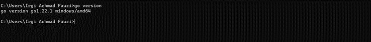

### 2.1.4 EKSTENSI GOLANG

Ekstensi yang dibutuhkan saat menggunakan golang di visual studio code.

1. Ekstensi Go 
Hal yang paling penting dalam pengembangan golang, agar bisa menggunakan bahasa golang pada proyek yang akan di bangun.

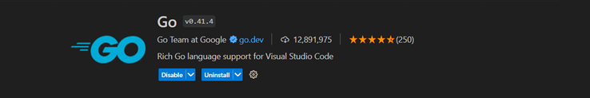

2.	Ekstensi Error Lens
Ekstensi untuk menyorot langsung jika ada kesalahan pada kode maka akan ada peringatan langsung pada editor kita.

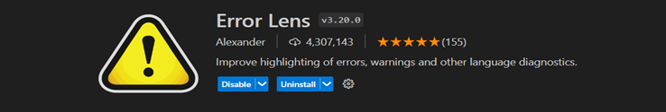

3. Ekstensi Live
Live Server ini untuk run code di lokal tanpa harus reset halaman browser.

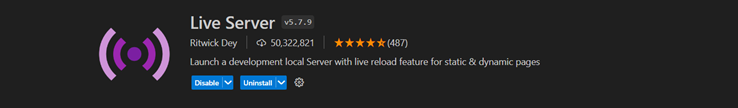

## CHAPTER 3 MEMBANGUN BACKEND (WEEK 2-3)

### 3.1 Hosting menggunakan GOOGLE CLOUD PLATFORM (GCP)

1.	Daftar melalui  https://cloud.google.com/ dan tekan mulai gratis

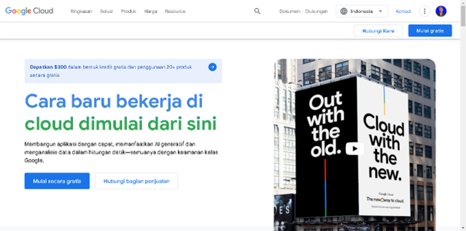

2.	Masukan email yang benar lalu  tekan agree

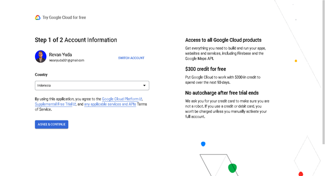

3.	masukan payment method seperti gambar di bawah. menggunakan kartu debit bisa memakai jenius, ayamjago dll.

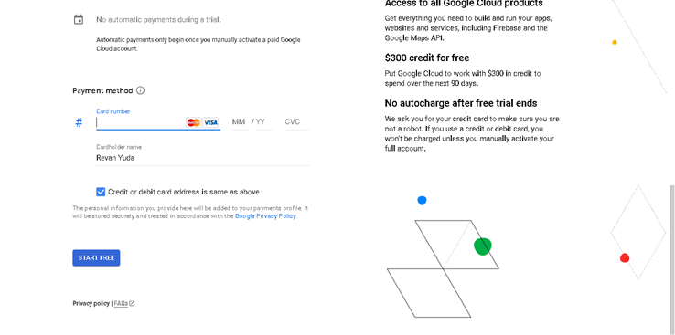

4.	Setelah itu masuk ke konsol dan masukan command seperti pada gambar di bawah.

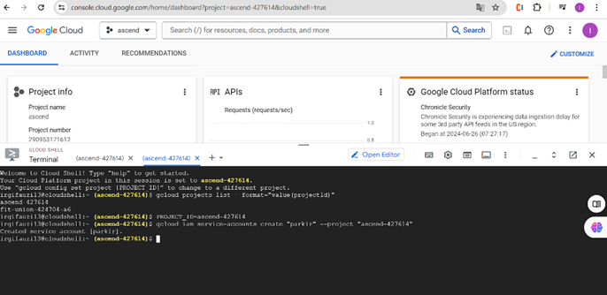

5. sampai mendapatkan key.json pada konsol .

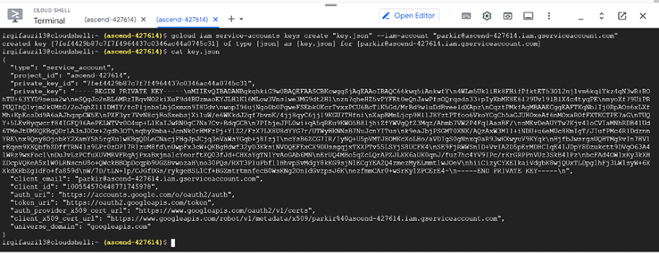

6. setelah mendapatkan key.json masuk ke setting pada repository backend masuk ke secret and variable pilih action klik new repository secret masukan value MONGOSTRING dan masukan secret dengan connection string MongoDB kalian lalu tambahkan lagi value google_credential dan masukan value dengan copy key.json di atas yang sudah dibuat.

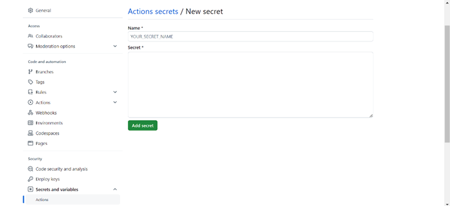

7.	masuk ke menu Cloud Build masuk ke setting pilih service account dan enable Cloud Function Developer dan Service Account User.

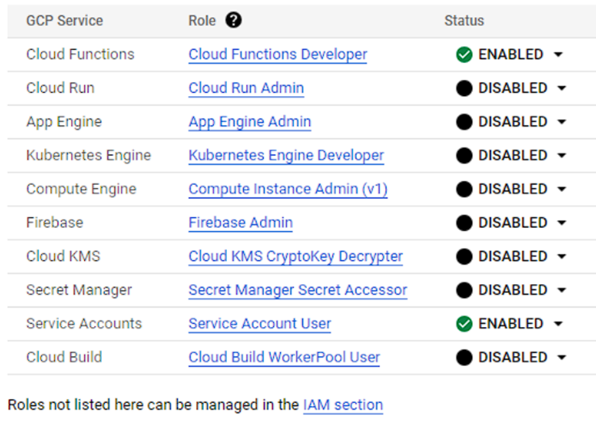

### 3.2 Membangun backend menggunakan golang 

1.	Struktur Golang untuk backend

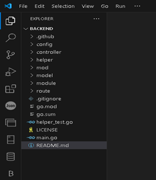

Struktur backend Go mencakup berbagai komponen penting seperti konfigurasi,controller, helper, model, dan route, yang masing masing memiliki peran spesifik dalam arsitektur aplikasi yang setiap komponennya berfungsi dan berinteraksi satu sama lain membangun aplikasi yang terorganisir.

2.	Config 

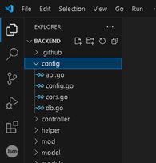

Folder konfigurasi merupakan file kunci yang digunakan untuk mengatur aplikasi atau sistem. Di dalamnya terdapat berbagai pengaturan penting yang menentukan cara kerja aplikasi atau sistem tersebut. Pengaturan ini dapat mencakup konfigurasi database, pengaturan lingkungan, koneksi ke layanan eksternal, dan banyak lagi yang diperlukan agar sistem berjalan dengan lancar dan sesuai kebutuhan.

3.	Controller

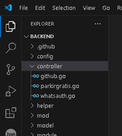

Controller ini untuk menangani permintaan HTTP dan mengarahkan alur aplikasi di dalamnya terdapat func yang akan dibuat dari Model yang telah dibuat lalu memanggil func tersebut pada route.

4.	Helper

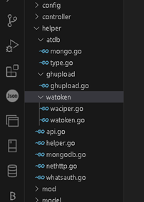

Folder helper berisi fungsi-fungsi kecil yang sering digunakan di berbagai bagian aplikasi. Fungsi-fungsi ini disebut fungsi helper atau fungsi utilitas. Fungsi helper biasanya digunakan untuk melakukan tugas-tugas umum yang sering diulang, seperti format tanggal, mengelola string, dan validasi data.

5.	Model

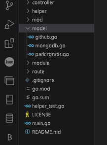

 Folder model merupakan bagian penting dalam arsitektur aplikasi, membantu mengelola data dan aturan aplikasi dengan lebih terorganisir, aman, dan rapi. Gunakan folder model untuk membangun aplikasi yang kokoh dan mudah dikembangkan.

 6.	Route

 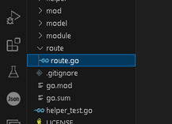

 Folder route ini berisi konfigurasi routing untuk aplikasi, seperti definisi endpoint dan menghubungkan fungsi-fungsi yang sudah dibuat pada controller. dan membuat endpoint untuk func GET, POST, PUT dan delete.
 

### 3.1 FRONTEND 

Hal pertama yang harus di lakukan adalah membuat kode untuk membuat open layer. Fitur ini adalah tampilan open street map yang akan muncul pada website Dengan menggunakan bahasa pemrograman javascript dan library dari skypack.

Berikut adalah langkah-langkah untuk membuat fitur open layer

1. buatlah folder baru dan masuk ke dalam visual studio code.

2. lalu buat file index.html, main.js, skeleton.css bisa mendowload disini
http://getskeleton.com dan jangan lupa menginstall node js.

3. isi kode program seperti gambar di bawah.

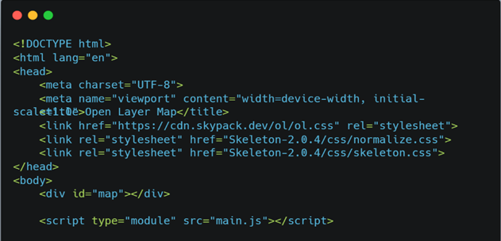

Disini kita membuat link pada skypack ini adalah tautan ke lembar gaya css Dari open layer. Yang digunakan untuk styling elemen elemen pada peta. Lalu ada link rel untuk menghubungkan ke skeleton css yang sudah di dowload.Di body kita menambahkan div id=”map” ini untuk menampung peta interaktif Yang akan dibuat menggunakan open layer. Dan tag javascript untuk Menambahkan fungsi ke peta pada open layer.

Lalu menambahkan css pada file skeleton.css yang sudah di dowload di getskeleton.com Tambahkan kode di paling bawah kode ini untuk mengatur posisi dan Lebar pada map.

lalu kita membuat file main.js

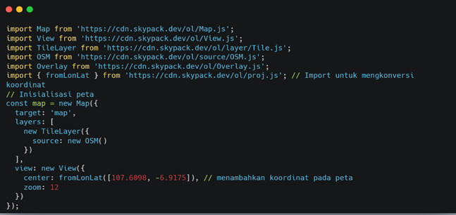

Disini terdapat modul modul dari open layer yang akan diimport ke kode. Ada map Untuk membangun objek peta, View untuk mengatur tampilan peta, TileLayer untuk menambahkan lapisan peta berbasis tile, OSM (OpenStreetMap) sebagai sumber data lapisan tile, dan Overlay untuk menambahkan elemen overlay di atas peta, fromlonlatFungsi ini digunakan untuk mengonversi koordinat geografis dari format longitude dan latitude menjadi format yang sesuai dengan sistem proyeksi yang digunakan oleh peta OpenLayers. 

Lalu disini ada target map untuk menentukan elemen HTML dengan id map sebagaiTarget peta, layers menentukan lapisan-lapisan yang akan ditampilkan di peta. Dalam kode ini, hanya satu lapisan yang ditambahkan, yaitu TileLayer dengan modul OSM (OpenStreetMap). view menentukan tampilan peta, termasuk properti seperti pusat peta (dalam koordinat geografis) dan tingkat zoom. Center fromLonLat untuk mengonversi koordinat longitude dan latitude ke dalam koordinatyg sudah ditentukan. Dan zoom untuk memperbesar tampilan pada map.

Lalu kita jalankan kode tersebut dengan klik Go live seperti gambar di bawah.

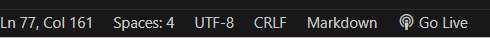

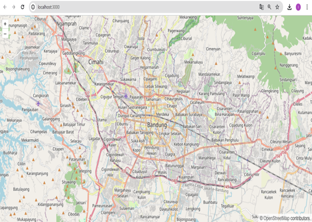

Langkah selanjutnya adalah membuat fungsi marker dan fungsi popup pada map kita perlu membuat file seperti gambar di bawah.

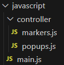

lalu kita isi marker.js dengan membuat fungsi createmarker.

Fungsi createMarker ini untuk membuat dan menampilkan marker pada peta OpenLayers dengan menggunakan koordinat geografis yang akan di buat. Fungsi createMarkerElement membuat elemen HTML untuk marker dengan gambar yang disesuaikan, dan marker ditambahkan ke peta dan fungsi mengembalikan objek marker yang telah dibuat.

lalu setelah itu kita juga membuat fungsi popup yang akan keluar setelah marker di klik.

.png)

Disini adalah fungsi untuk membuat popup pada marker yang telah di buat fungsi createPopups membuat pop-up berdasarkan koordinat yang diberikan dan memasukkannya ke peta. Fungsi displayPopup menampilkan konten pada pop-up dan menempatkannya di posisi yang ditentukan sesuai dengan lonlat yang dibuat di marker. Fungsi setPositioning mengatur posisi pop-up relatif terhadap koordinat yang diberikan.

lalu kita mengimport fungsi yang sudah di buat tadi masukan ke dalam main.js

.png)

kode di atas yaitu membuat untuk mengambil data marker dan pop-up dari URL fetch yang akan di ambil dari backend yang nanti akan dibuat. Data marker dan pop-up diambil melalui fetch. Sementara marker dibuat dengan createMapMarkers, pop-up dibuat dengan initializeMapPopups. Saat peta diklik di area marker,maka di map akan menampilkan popup yang terdapat di dalamnya isi dari url popup yang akan di tambahkan dari backend. dan saat peta diklik di area kosong, semua pop-up disembunyikan. dan memungkinkan pengguna melihat pop-up dan informasi marker pada peta interaktif.

