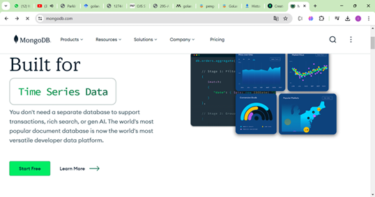
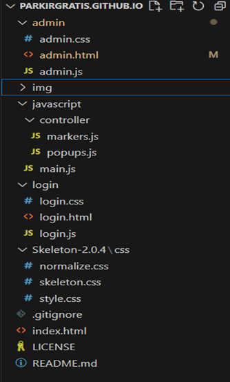

# INFORMASI PARKIR GRATIS 

## BAB 1 PENGENALAN WEBSITE PARKIR GRATIS 

### 1.1  Apa itu Website parkir gratis  

Website parkir gratis yang di tampilkan pada peta open street map ini menampilkan informasi tentang lokasi-lokasi parkir gratis pada minimarket di daerah bandung. dengan adanya website ini pengguna dapat menemukan lokasi parkir gratis dengan mudah dan menghemat biaya parkir. 

### 1.2  Tujuan dan manfaat Website parkir gratis  

Website parkir gratis ini memudahkan pelanggan minimarket mengetahui lokasi-lokasi yang terdapat fasilitas parkir gratis dan fasilitas lainnya. sehingga pengguna tidak perlu khawatir tentang biaya tambahan pada parkir. dengan menggunakan website ini pelanggan dapat menikmati pengalaman berbelanja lebih nyaman. selain itu, terdapat fasilitas seperti ATM dan UMKM yang meningkatkan kemudahan pengguna dalam memilih minimarket sesuai kebutuhan pengguna.  

## BAB 2 BAHASA PEMROGRAMAN DAN APLIKASI YANG DIGUNAKAN 

### 2.1 HTML  

HTML adalah singkatan dari Hypertext Markup Language, yang merupakan bahasa markup standar untuk membuat halaman web dan aplikasi web.
Ini digunakan untuk menyusun konten di web dengan mendefinisikan makna dan tata letak teks, gambar, tautan, dan elemen lainnya. Elemen HTML diwakili oleh tag yang tertutup dalam tanda kurung sudut, seperti < head >,< title >,< body >, dll. HTML sangat penting untuk pengembangan web dan merupakan dasar dari sebagian besar situs web di internet.( Izzeddin Gur, 2022) 

### 2.2	CSS	 

CSS adalah singkatan dari Cascading Style Sheets, yang merupakan bahasa lembar gaya yang digunakan untuk menggambarkan presentasi dokumen yang ditulis dalam HTML. Ini mengontrol tata letak dan tampilan beberapa halaman web sekaligus dengan memisahkan konten dari desain. CSS memungkinkan pengembang web untuk menentukan gaya untuk berbagai elemen seperti font, warna, spasi, dan tata letak.(Daniel Zhu, Salome Wairimu Kariuki 2020) 

### 2.3	JAVASCRIPT	 

JavaScript adalah bahasa pemrograman tingkat tinggi yang ditafsirkan terutama digunakan untuk membuat konten interaktif dan dinamis di situs web. JavaScript memungkinkan pengembang untuk menambahkan fungsionalitas ke halaman web, mengontrol perilaku elemen yang berbeda, dan berinteraksi dengan pengguna secara real-time. Biasanya digunakan untuk tugas-tugas seperti validasi formulir, membuat peta interaktif, pembaruan konten dinamis, dan lain-lain. (Abhishek Gedam, 2023) 

### 2.4	CSS SKELETON / GETSKELETON	 

Skeleton adalah Framework CSS yang ringan dan responsif yang dirancang untuk memberikan kerangka kerja dasar untuk pengembangan web. Ini terdiri dari grid sederhana, elemen dasar seperti tombol, formulir, dan tipografi, serta beberapa komponen responsif yang memungkinkan pengembang memulai proyek web dengan cepat tanpa harus menulis CSS dari awal. 

### 2.5	VISUAL STUDIO CODE	 

Visual Studio Code adalah editor kode sumber yang ringan namun kuat yang berjalan di desktop Anda dan tersedia untuk Windows, macOS dan Linux. Muncul dengan dukungan built-in untuk JavaScript, TypeScript dan Node.js dan memiliki ekosistem ekstensi yang kaya untuk bahasa dan runtime lain (seperti C ++, C #, Java, Python, PHP, Go, .NET).(Code.visualstudio.com 05 juni 2024)  

### 2.6	NODE JS	 

Node.js adalah lingkungan runtime JavaScript populer untuk membangun aplikasi web. Ini memungkinkan pengembang untuk menulis kode sisi server di JavaScript dan mengelola sisi klien dan server. Node.js memastikan kinerja tinggi melalui input/output yang digerakkan oleh peristiwa, non-pemblokiran, dan paradigma asinkron.(Bonjar Basumatary, Nishant Agnihotri 2022) 

### 2.7 MONGODB 

MongoDB adalah basis data NoSQL yang bersifat document based. MongoDB bersifat document based artinya MongoDB tidak memilki tabel,
kolom ataupun baris. MongoDB hanya memilki koleksi dan dokumen.Data yang disimpan dalam basis data MongoDB berupa file JSON yang disebut dengan istilah BSON (Binary JSON).Sistem basis data MongoDB menggunakan key-value, artinya setiap dokumen dalam MongoDB dipastikan memilki key (Putra & Rahmayeni, 2016). 

## BAB 3 PERANCANGAN APLIKASI 

### 3.1 FRONTEND 

Hal pertama yang harus di lakukan adalah membuat kode untuk membuat open layer. Fitur ini adalah tampilan open street map yang akan muncul pada website Dengan menggunakan bahasa pemrograman javascript dan library dari skypack.

Berikut adalah langkah-langkah untuk membuat fitur open layer

1. buatlah folder baru dan masuk ke dalam visual studio code.

2. lalu buat file index.html, main.js, skeleton.css bisa mendowload disini
http://getskeleton.com dan jangan lupa menginstall node js.

3. isi kode program seperti gambar di bawah.

Disini kita membuat link pada skypack ini adalah tautan ke lembar gaya css Dari open layer. Yang digunakan untuk styling elemen elemen pada peta. Lalu ada link rel untuk menghubungkan ke skeleton css yang sudah di dowload.Di body kita menambahkan div id=”map” ini untuk menampung peta interaktif Yang akan dibuat menggunakan open layer. Dan tag javascript untuk Menambahkan fungsi ke peta pada open layer.

Lalu menambahkan css pada file skeleton.css yang sudah di dowload di getskeleton.com Tambahkan kode di paling bawah kode ini untuk mengatur posisi dan Lebar pada map.

lalu kita membuat file main.js

Disini terdapat modul modul dari open layer yang akan diimport ke kode. Ada map Untuk membangun objek peta, View untuk mengatur tampilan peta, TileLayer untuk menambahkan lapisan peta berbasis tile, OSM (OpenStreetMap) sebagai sumber data lapisan tile, dan Overlay untuk menambahkan elemen overlay di atas peta, fromlonlatFungsi ini digunakan untuk mengonversi koordinat geografis dari format longitude dan latitude menjadi format yang sesuai dengan sistem proyeksi yang digunakan oleh peta OpenLayers. 

Lalu disini ada target map untuk menentukan elemen HTML dengan id map sebagaiTarget peta, layers menentukan lapisan-lapisan yang akan ditampilkan di peta. Dalam kode ini, hanya satu lapisan yang ditambahkan, yaitu TileLayer dengan modul OSM (OpenStreetMap). view menentukan tampilan peta, termasuk properti seperti pusat peta (dalam koordinat geografis) dan tingkat zoom. Center fromLonLat untuk mengonversi koordinat longitude dan latitude ke dalam koordinatyg sudah ditentukan. Dan zoom untuk memperbesar tampilan pada map.

Lalu kita jalankan kode tersebut dengan klik Go live seperti gambar di bawah.

Langkah selanjutnya adalah membuat marker pada map

